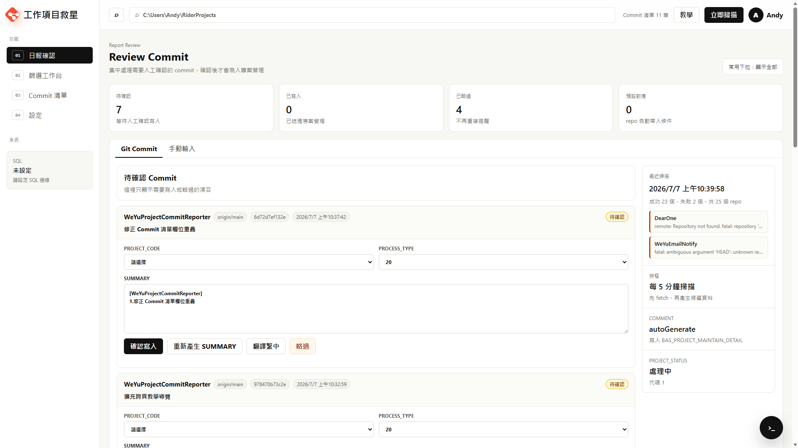

# 工作項目救星 使用說明

工作項目救星是一個本機使用的 Git 日報輔助工具。它會依照系統設定中的 `RepoRoot` 掃描底下的 Git 專案，把每天已 commit 的工作整理成日報候選資料。你在網頁確認後，才會寫入 `WeyutechV6.dbo.BAS_PROJECT_MAINTAIN_DETAIL`。

網頁預設只開在本機：

```text
http://127.0.0.1:5147
```

## 畫面預覽



主畫面會集中顯示待確認 Commit、目前掃描統計、最近掃描狀態與右下角後台指令入口。使用者可以先按「立即掃描」更新候選資料，再逐筆確認 `PROJECT_CODE`、`PROCESS_TYPE` 與 `SUMMARY`，確認後才會寫入專案管理。

## 主要功能

- 每 5 分鐘自動掃描 Git commit。
- 掃描前會先執行 `git fetch --prune`，抓遠端最新 commit。
- 排除 merge commit。
- 只產生候選資料，不會自動寫入資料庫。
- 可在網頁確認 `PROJECT_CODE`、`PROCESS_TYPE`、`SUMMARY` 後寫入日報。
- 可手動輸入日報，不一定要有 Git commit。
- 可設定 repo 名稱對應固定的 `PROJECT_CODE` / `PROCESS_TYPE`。
- 可設定常用 `PROJECT_CODE` / `PROCESS_TYPE`，縮小日報欄位下拉選單。
- 可在網頁調整掃描根目錄、作者、回溯天數、排程間隔與寫入人員。
- 右下角可開啟後台指令面板，查看掃描時正在執行的 Git 指令與結果。
- 第一次進入網頁會顯示教學導覽，也可按右上角「教學」重新查看。
- 英文 SUMMARY 可按「翻譯繁中」轉成繁體中文。
- Windows 排程使用隱藏模式執行，不會跳出 PowerShell 視窗。

## 啟動網頁

在專案資料夾執行：

```powershell
powershell.exe -NoProfile -ExecutionPolicy Bypass -File .\scripts\Run-Web.ps1
```

開啟：

```text
http://127.0.0.1:5147
```

如果要指定 Port：

```powershell
powershell.exe -NoProfile -ExecutionPolicy Bypass -File .\scripts\Run-Web.ps1 -Port 5147
```

## 第一次使用設定

### 執行需求

- Windows
- Git
- .NET 8 SDK

如果 `dotnet` 不在 PATH，可以設定：

```powershell
$env:PROJECT_REPORTER_DOTNET_EXE = "C:\Users\rdpuser\.dotnet\dotnet.exe"
```

### 1. 設定 SQL 連線字串

連線字串會用 Windows DPAPI 加密後存在本機 `data\connection-string.protected`，不會寫進程式碼。

```powershell
powershell.exe -NoProfile -ExecutionPolicy Bypass -File .\scripts\Set-ConnectionString.ps1 -ConnectionString "Data Source=10.0.20.20,1433;Initial Catalog=WeyutechV6;User ID=sa;Password=Weyu0401~;TrustServerCertificate=True;Encrypt=False"
```

請把 `YOUR_SQL_SERVER`、`YOUR_USER`、`YOUR_PASSWORD` 換成實際值。

### 2. 安裝掃描排程

```powershell
powershell.exe -NoProfile -ExecutionPolicy Bypass -File .\scripts\Install-ScheduledTask.ps1 -Minutes 5
```

排程名稱：

```text
ProjectCommitReporter Commit Scan
```

排程只會產生候選資料，不會直接寫 DB。

## 畫面怎麼用

### 教學導覽

第一次進入網頁時，系統會自動顯示教學導覽，依序說明：

- 掃描根目錄
- 立即掃描
- 統計卡片
- 日報輸入方式
- 待確認 Commit
- 掃描狀態
- 篩選工作台
- 常用下拉設定
- 預設對應設定
- Commit 清單
- Commit 詳細內容
- 系統設定
- 掃描與排程設定
- 資料庫與設定檔狀態
- 後台指令面板

如果使用者關閉後想再看一次，可以按右上角「教學」重新開啟。也可以在網址加上 `?tour=1` 強制顯示。

### 日報確認

日報確認分成兩個 Tab。

#### Git Commit

這裡會顯示掃描到、還沒處理的 commit。每一筆可以做：

- 選擇 `PROJECT_CODE`
- 選擇 `PROCESS_TYPE`
- 編輯 `SUMMARY`
- 按「確認寫入」
- 按「重新產生 SUMMARY」
- 按「翻譯繁中」
- 按「略過」

按「確認寫入」後才會新增到 `BAS_PROJECT_MAINTAIN_DETAIL`。

#### 手動輸入

如果某個工作沒有對應 Git commit，可以直接手 KEY。需要填：

- 工作日期
- `PROJECT_CODE`
- `PROCESS_TYPE`
- `SUMMARY`

填完按「確認寫入」即可。

### 篩選工作台

篩選工作台用來管理常用下拉選項與 repo 預設對應。

#### 常用下拉設定

這裡不是 Commit 清單篩選功能，而是用來縮小日報填寫時的 `PROJECT_CODE` / `PROCESS_TYPE` 下拉選單。

操作方式：

1. 到左側選單點「篩選工作台」。
2. 進入「常用下拉設定」。
3. 展開「常用 PROJECT_CODE」或「常用 PROCESS_TYPE」。
4. 勾選平常會用到的專案與流程。
5. 按「保存常用選項」。

保存後會套用在：

- 日報確認的 Commit 卡片
- 手KEY日報
- 預設對應設定

如果沒有勾選任何項目，系統會顯示全部選項。

如果某筆 Commit 已經由預設對應自動帶入 `PROJECT_CODE` / `PROCESS_TYPE`，即使該值不在常用清單內，畫面也會保留該值，避免已帶入資料消失。

#### 預設對應設定

用來管理 repo 名稱與固定 `PROJECT_CODE` / `PROCESS_TYPE` 的對應關係。

例如：

```text
專案名稱：HongCheng-Smart-Scheduler
PROJECT_CODE：HC-EC(2601)
PROCESS_TYPE：20 開發Loader
```

之後如果 commit 來自 `HongCheng-Smart-Scheduler`，日報確認畫面會自動帶入這組 `PROJECT_CODE` / `PROCESS_TYPE`。

預設對應表的「加入常用」可以把該組 `PROJECT_CODE` / `PROCESS_TYPE` 加進常用下拉設定。

### Commit 清單

這裡是查詢用，不直接處理日報寫入。

可以依照以下條件篩選：

- 狀態
- Repo
- 作者
- 關鍵字
- 開始時間
- 結束時間

可點「查看」看 commit 詳細內容。

### 後台指令

右下角的 `>_` 浮動按鈕可以開啟後台指令面板。掃描時會顯示：

- 掃描開始與完成時間。
- 每個 repo 執行的 `git` 指令。
- 指令是否完成、exit code、stdout / stderr 摘要。
- 目前正在執行的指令數量。

面板只顯示本機服務啟動後的近期活動紀錄；重啟服務後，紀錄會重新開始累積。

### 系統設定

左側選單的「設定」頁用來管理本機掃描、排程與資料庫連線狀態。

設定頁主畫面會顯示目前生效的設定總覽：

- 掃描根目錄
- Commit 作者
- 掃描排程
- 回溯天數
- 寫入人員
- 資料庫連線狀態
- Runtime config 路徑

如果要修改設定，請按「編輯設定」開啟設定視窗。

設定視窗可修改：

- `RepoRoot`：Git repository 的集中根目錄。
- `GitAuthorName`：掃描時用來過濾 commit author name。
- `GitAuthorEmail`：保留作為作者識別資訊。
- `ScanLookbackDays`：掃描回溯天數，0 表示只看今天 00:00 之後的 commit。
- `ScheduleMinutes`：Windows Task Scheduler 掃描間隔。
- `PrincipalUser`：寫入 `PRINCIPAL_USER` 的值。
- `AuditUser`：寫入 `CREATE_USER` / `EDIT_USER` 的值。

按「保存設定」只會更新本機 runtime JSON，下一次手動掃描或排程掃描才會套用。

按「保存並套用排程」會先保存設定，再重新註冊 Windows Task Scheduler 的掃描間隔。

設定保存位置：

```text
data\runtime-settings.json
```

SQL 密碼不會在網頁輸入或保存，也不會寫入 `runtime-settings.json`。請繼續使用 `scripts\Set-ConnectionString.ps1` 產生 `data\connection-string.protected`。

## 寫入資料庫規則

確認寫入時會新增一筆 `dbo.BAS_PROJECT_MAINTAIN_DETAIL`，主要欄位規則如下：

```text
BAS_PROJECT_MAINTAIN_DETAIL_SID = dbo.GetSid()
PROJECT_CODE = 畫面選擇值
PROCESS_TYPE = 畫面選擇值
SUMMARY = 畫面文字
PROJECT_STATUS = '1'
COMMENT = 'autoGenerate'
PRINCIPAL_USER = 設定值，預設 Andy
SUPPORT_USER = ''
REVIEWER_USER = ''
START_EXPECTED_TIME = 工作日期
START_TIME = 工作日期
EXPECTED_TIME = '1900-01-01'
END_TIME = NULL
SEQ = 0
ENABLE_FLAG = 'Y'
CREATE_USER = 設定值，預設 ADMINV2
EDIT_USER = 設定值，預設 ADMINV2
CREATE_TIME = GETDATE()
EDIT_TIME = GETDATE()
FILE_NAME = NULL
```

## 掃描規則

- 掃描根目錄以「設定」頁目前顯示的 `RepoRoot` 為準。
- 程式預設值為 `C:\Users\rdpuser\RiderProjects`，可在網頁設定中改成其他 Git repository 集中資料夾。
- 只掃 Git repo。
- 掃描前會先 `git fetch --prune`。
- 有 upstream 時掃 upstream ref，例如 `origin/main`。
- 沒有 upstream 時掃本機 `HEAD`。
- 排除 merge commit。
- 預設只抓作者 `Andy` 的 commit。
- 同一 repo + commit SHA 不會重複產生候選。

## 常用指令

### 手動掃描

```powershell
powershell.exe -NoProfile -ExecutionPolicy Bypass -File .\scripts\Scan-Commits.ps1
```

### 執行測試

```powershell
powershell.exe -NoProfile -ExecutionPolicy Bypass -File .\scripts\Test.ps1
```

或直接用本機 .NET：

```powershell
C:\Users\rdpuser\.dotnet\dotnet.exe test .\ProjectCommitReporter.sln
```

### 重新安裝排程

```powershell
powershell.exe -NoProfile -ExecutionPolicy Bypass -File .\scripts\Install-ScheduledTask.ps1 -Minutes 5
```

## 常見問題

### 每 5 分鐘掃描會不會自動寫入資料庫？

不會。排程只會掃描並產生候選資料，必須在網頁按「確認寫入」才會寫 DB。

### 為什麼看不到新的 commit？

請先確認：

- commit 已經 push 到遠端。
- commit author 符合設定值，預設是 `Andy`。
- commit 不是 merge commit。
- 該 repo 有 upstream，或本機 `HEAD` 有可掃描的 commit。
- 最近掃描狀態沒有 fetch 失敗。
- `ScanLookbackDays` 沒有設得太短。

也可以按網頁右上角「立即掃描」。

### 為什麼每次都要選 PROJECT_CODE / PROCESS_TYPE？

到「篩選工作台」建立預設對應。之後符合 repo 名稱的 commit 會自動帶入。

### 為什麼 SQL 連線失敗？

請重新設定連線字串：

```powershell
powershell.exe -NoProfile -ExecutionPolicy Bypass -File .\scripts\Set-ConnectionString.ps1 -ConnectionString "Data Source=YOUR_SQL_SERVER,1433;Initial Catalog=WeyutechV6;User ID=YOUR_USER;Password=YOUR_PASSWORD;TrustServerCertificate=True;Encrypt=False"
```

也可以到「設定」頁確認資料庫狀態與 protected file 路徑。

## 專案結構

```text
project-commit-reporter
├─ src
│  ├─ ProjectCommitReporter.Core    # Git 掃描、候選資料、SQL 寫入與 runtime 設定
│  └─ ProjectCommitReporter.Web     # 本機 Web UI 與 API
├─ tests                            # xUnit 測試
├─ scripts                          # 啟動、掃描、測試、排程與連線設定腳本
├─ docs                             # README 圖片與文件素材
├─ data                             # 本機狀態與加密連線字串，不提交 Git
└─ README.md
```

## 注意事項

- `data/` 是本機資料，不要提交到 Git。
- `publish/` 是建置輸出，不要提交到 Git。
- `output/` 是測試或截圖輸出，不要提交到 Git。
- SQL 密碼不要寫進程式碼或 README。
- 本工具預設只綁定 `127.0.0.1`，不要改成區網公開，除非已確認安全性。
